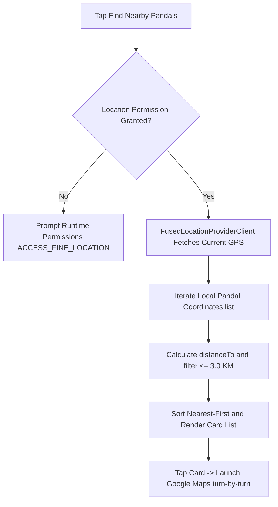

# 📍 Pandal Finder

### Real-Time GPS Festival Navigator

[](https://kotlinlang.org/)
[](https://gradle.org/)
[](https://developer.android.com/)
[](https://code.visualstudio.com/)
[](https://developers.google.com/android/reference/com/google/android/gms/location/FusedLocationProviderClient)
[](LICENSE)

---

## 📖 Overview

**Pandal Finder** is a lightweight, high-accuracy Android application that automatically scans the user's location and filters nearby community festival pandals within a **3 km radius**. 
By computing geodesic distances locally via standard Android location coordinate mathematics, the app requires zero backend database dependencies, making it extremely fast, private, and lightweight.

### Purpose

* **Bypass Heavy IDEs**: Demonstrate compile-to-install Android workflows using only VS Code command-line hooks.
* **Instant GPS Auditing**: Track real-time device coordinate changes using Google Play Services' FusedLocation client.
* **Geodesic Crossover Filtering**: Calculate direct distance separations (`Location.distanceTo`) locally and sort locations nearest-first.
* **Single-Tap Navigation**: Transition directly to Google Maps navigation via geo intent routing for turn-by-turn routes.

---

## ✨ Features

### 🚀 Core Experience

* **Air-Gapped Privacy**: Performs all distance calculations and sorting algorithms locally on the device with zero backend connections.
* **Smart Fused Location**: Leverages Google Play Services' `FusedLocationProviderClient` for battery-efficient location tracking.
* **One-Click Turn-by-Turn**: Decodes target coordinates and fires explicit geo intents (`google.navigation:q=lat,lng`) into native mapping applications.
* **Clean Material UI**: Single-screen dashboard utilizing responsive RecyclerView structures to present distance cards.
* **Direct CLI Deployments**: Compiled and loaded onto physical test hardware using native command line batch sequences.

---

### 🎨 Interactive App Operations



---

### 💻 Code Customization Engine

#### Adding Custom Coordinates

You can easily modify the list of target locations. Open `app/src/main/java/com/pandalfinder/Pandal.kt`:

```kotlin
fun getSamplePandals(): List<Pandal> {
    return listOf(
        Pandal("Your Custom Location Name", 22.5726, 88.3639),
        // Add more coordinates here (Name, Latitude, Longitude)
    )
}
```

#### Changing Search Radius

Open `app/src/main/java/com/pandalfinder/MainActivity.kt` and adjust the search threshold:

```kotlin
private const val MAX_DISTANCE_KM = 3.0f  // Change to your desired boundary
```

---

## 📁 Project Directory Structure

```text
PandalFinder:\
├── app\                                # Primary application workspace
│   ├── build.gradle                    # Application build scripts & dependencies
│   └── src\main\
│       ├── AndroidManifest.xml         # App configuration & permissions
│       ├── java\com\pandalfinder\      # Kotlin sources
│       │   ├── MainActivity.kt         # Core location and UI thread coordinator
│       │   ├── Pandal.kt               # Location data structure & hardcoded coordinates
│       │   └── PandalAdapter.kt        # Card list RecyclerView formatter
│       └── res\
│           ├── layout\
│           │   ├── activity_main.xml   # Dashboard design interface
│           │   └── item_pandal.xml     # Single Pandal list item design
│           └── values\
│               └── strings.xml         # Shared UI value attributes
│
├── gradle\                             # Gradle wrapper config files
├── build.gradle                        # Root project build script
├── settings.gradle                     # Project modular setup
├── local.properties                    # SDK disk path mapping
├── gradlew                             # Linux shell wrapper script
└── gradlew.bat                         # Windows batch wrapper script
```

---

## 🛠️ Technical Specifications

### Core Architecture

* **Development Language**: Kotlin (modern OOP structure).
* **Build Tooling**: Gradle Wrapper (run fully from terminal).
* **Location API**: Google Play Services Location SDK (`ACCESS_FINE_LOCATION`).
* **Android Target Boundaries**: Minimum SDK: `24` (Android 7.0) | Target SDK: `33` (Android 13).
* **Navigation Trigger**: Explicit android geo intents (`google.navigation:q=...`).

---

## 📦 Installation & Setup

### 🟢 First-Time Setup
1. **Set Android SDK**: Set the local path of your Android SDK in `local.properties`:
   ```properties
   sdk.dir=C\:\\Users\\YourUsername\\AppData\\Local\\Android\\Sdk
   ```
2. **Setup Device**: Enable **USB Debugging** inside your Android device's "Developer Options".
3. **Connect Device**: Plug your device in via USB and verify connection:
   ```bash
   adb devices
   ```

---

### ▶ Run
* **Compile Debug APK**: Build the debug bundle:
  ```powershell
  .\gradlew.bat assembleDebug
  ```
* **Install to Device**: Install the freshly built APK onto your connected physical device:
  ```powershell
  adb install app\build\outputs\apk\debug\app-debug.apk
  ```

Launch App → Open **Pandal Finder** → Tap **Find Nearby Pandals**!

---

## 🛠 Troubleshooting

* **Location not detected**: Ensure GPS is turned ON and location permission is granted in App Settings.
* **Device not found**: Unplug/replug your phone, verify USB Debugging is ON, and check `adb devices`.
* **Build failed**: Verify `sdk.dir` path inside `local.properties` or run clean: `.\gradlew.bat clean`.
* **Maps not opening**: Make sure Google Maps is installed and set as the default navigation client.

---

## 🔧 Manual Commands

* **Clean Build**:
  ```powershell
  .\gradlew.bat clean
  ```
* **Build Debug APK**:
  ```powershell
  .\gradlew.bat assembleDebug
  ```
* **Install via ADB**:
  ```powershell
  adb install app\build\outputs\apk\debug\app-debug.apk
  ```
* **Launch App via ADB**:
  ```powershell
  adb shell am start -n com.pandalfinder/.MainActivity
  ```

---

## 🎯 Development Roadmap

### ✅ Completed
* Built permission validation sequences handling ACCESS_FINE_LOCATION at runtime.
* Completed local geodesic distance evaluation sorting nearest pandals first.
* Bypassed IDE compile requirements utilizing terminal Gradle wrapper binaries.
* Integrated turn-by-turn navigation routing geo intents directly to Google Maps.

### 🚧 In Progress
* Integrating customizable search limits directly inside the main UI layout.
* Porting offline JSON loaders to let users drop customized lists without editing code.

### 📅 Planned
* Implementing map overlays with simple markers using offline OpenStreetMap cards.
* Adding a bookmark database to let users save favorite destinations.

---

## 🤝 Contributing & Support

Contributions are welcome! Please follow these steps to add new maps or coordinates:

1. Create a feature branch: `git checkout -b feature/new-coordinates`
2. Test on a physical device.
3. Commit your coordinates changes.
4. Push and open a pull request.

---

## 📜 Licenses & Credits

### Open Source Runtimes
* **Kotlin Runtime**: Distributed under the [Apache License 2.0](https://www.apache.org/licenses/LICENSE-2.0).
* **FusedLocationProviderClient**: Provided by Google Play Services under standard SDK terms.

### Credits
* Built using lightweight Kotlin packaging templates.
* Configured to build purely on VS Code and command line environments.
